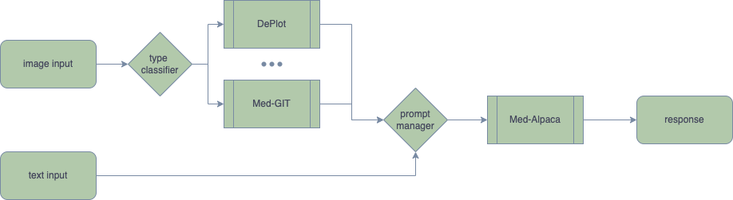
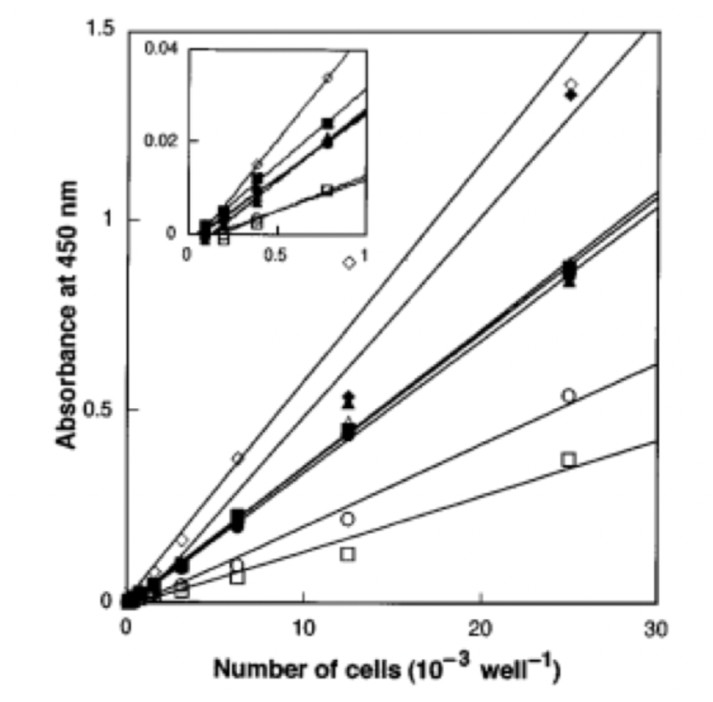
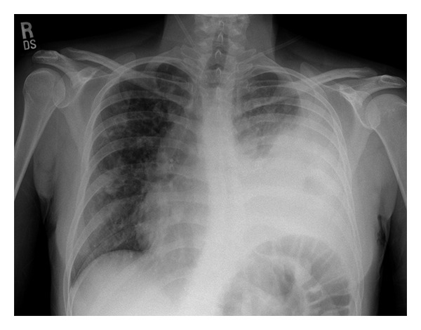

  
  
# Visual Med-Alpaca: Bridging Modalities in Biomedical Language Models [[BLOG](https://cambridgeltl.github.io/visual-med-alpaca/)]

[Chang Shu](https://ciaranshu.github.io)1\*,  Baian Chen2\*,  [Fangyu Liu](http://fangyuliu.me)1,  [Zihao Fu](https://fuzihaofzh.github.io)1,  [Ehsan Shareghi](https://eehsan.github.io)3,  [Nigel Collier](https://sites.google.com/site/nhcollier/home/)1

[University of Cambridge](https://ltl.mmll.cam.ac.uk)1      Ruiping Health2     [Monash University](https://www.monash.edu/it/dsai)3

  
## Abstract
[**Visual Med-Alpaca**](https://github.com/cambridgeltl/visual-med-alpaca) is an open-source, multi-modal foundation model designed specifically for the biomedical domain, built on the [LLaMa-7B](https://research.facebook.com/publications/llama-open-and-efficient-foundation-language-models/). With a few hours of instruct-tuning and plug-and-play visual modules, it can perform a range of tasks from reading radiological images and answering complex clinical questions, while being easily deployable and replicable with a single gaming GPU. 

  

## Demo  
  

  
  
Please fill out [this form](https://forms.gle/X4A8sib7qpU499dY8) to access the online demo. **Warning: Only for academic usage and do not apply to real clinical scenarios!**

## Overview

Domain-specific foundation models are crucial in the biomedical field as the language used in biomedical text is highly specialized and contains numerous domain-specific terms and concepts not found in general domain text corpora like Wikipedia and Books. Pre-training on significant amounts of biomedical text has been shown to enhance the performance of language models on various biomedical text mining tasks when compared to existing publicly available biomedical PLMs.  
  
However, with the large number of parameters in modern language models, the cost of fine-tuning even a 7B model solely on PubMed is too expensive for most academic institutions that lack sufficient computing resources. Pre-training models on extensive medical image datasets to acquire multi-modal abilities is even more costly. Therefore, more cost-effective techniques such as Adapter, Instruct-Tuning and Prompt Augmentation are being explored to develop a model that can be trained and deployed on gaming-level graphics cards while still possessing sufficient capabilities. Furthermore, there is no public multimodal foundation model designed for biomedical usage to the best of our knowledge. As a result, we are pleased to release the [**Visual Med-Alpaca**](https://github.com/cambridgeltl/visual-med-alpaca), an open-source, multi-modal, biomedical foundation model.  
  
Visual Med-Alpaca uses a prompt manager to merge the textual and visual information into the prompt for generating responses with biomedical expertise. The model is fine-tuned using two distinct datasets to incorporate biomedical knowledge and visual modality. The process involves collecting inquiries from various medical datasets and synthesizing answers with a gpt-3.5-turbo model. The study involves the integration of visual foundation models, namely the DEPLOT and Med-GIT models, to accommodate medical images as inputs.  
  
The Med-GIT model is a GIT fine-tuned specifically on the ROCO dataset to facilitate specialized radiology image captioning. The training procedure for the model is available in the Github repository. Visual input is a critical element of the medical domain, and the system architecture is designed to facilitate the seamless integration of alternate medical visual foundation models. The model's architecture is developed to translate image to text, followed by a cognitive engagement in reasoning over the text thereby derived.  
  
The most important task in the future is to systematically evaluate the medical proficiency and potential defects of Visual Med-Alpaca, including but not limited to misleading medical advice, incorrect medical information, etc. In addition to the conventional use of benchmarking and manual evaluation, we hope to target different model users (doctors and patients) and evaluate all aspects of the model in a user-centred manner.  
  
**It is also important to note that Visual Med-Alpaca is strictly intended for academic research purposes and not legally approved for medical use in any country.**

  
### Resources:  

We apologize for the inconvenience, but this project is currently undergoing internal ethical screening at Cambridge University. We anticipate releasing the following assets within the next 1-2 weeks. You are more than welcome to [Join Our Waitlist](https://forms.gle/X4A8sib7qpU499dY8), and we'll notify you as soon as they become available.

*   Data: [Github](https://github.com/cambridgeltl/visual-med-alpaca/tree/main/data)
*   Code: [Github](https://github.com/cambridgeltl/visual-med-alpaca/tree/main/code)
*   Models: [visual-med-alpaca](https://forms.gle/X4A8sib7qpU499dY8), [med-alpaca](https://forms.gle/X4A8sib7qpU499dY8), [med-alpaca-lora](https://forms.gle/X4A8sib7qpU499dY8), [med-git](https://forms.gle/X4A8sib7qpU499dY8)
*   Demo: [visual-med-alpaca](https://forms.gle/X4A8sib7qpU499dY8)

## Model Architecture and Training Pipeline  
  

  
Visual Med-Alpaca bridges the textual and visual modalities through the prompt augmentation method. Firstly, the image input is fed into a type classifier to identify the appropriate module for converting visual information into an intermediate text format, which is then appended to the text inputs for subsequent reasoning procedures. For instance, medical plots are transformed into intermediate linearized tables through the use of the [DePlot](https://huggingface.co/docs/transformers/main/model_doc/deplot) module. The prompt manager then merges the textual information extracted from images and text inputs into the prompt for Med-Alpaca, a large language model used for generating responses with the expertise in biomedical domain.  
  
To incorporate biomedical knowledge and visual modality into the foundation model LLaMA-7B, we carried out fine-tuning using two distinct datasets. Initially, we performed standard fine-tuning and low-rank adaptation (LoRA) fine-tuning on LLaMA-7B model using a model-generated dataset comprising of 54,000 biomedical examples for instruction-tuning purposes. Secondly, we fine-tuned the [Microsoft GIT](https://github.com/microsoft/GenerativeImage2Text) model on the [Radiology Objects in Context (ROCO)](https://github.com/razorx89/roco-dataset) dataset to incorporate visual modality.

## Domain Adaptation: Self-Instruct in Biomedical Domain  
  
The process of collecting inquiries from various medical question-and-answer datasets ([MEDIQA RQE](https://huggingface.co/datasets/bigbio/mediqa_rqe), [MedQA](https://huggingface.co/datasets/bigbio/med_qa), [MedDialog](https://huggingface.co/datasets/bigbio/meddialog), [MEDIQA QA](https://huggingface.co/datasets/bigbio/mediqa_qa), [PubMedQA](https://huggingface.co/datasets/bigbio/pubmed_qa)) is implemented in our study. This approach aims to increase the diversity and thoroughness of the dataset and improve the accuracy and comprehensiveness of the obtained results.  
  
We synthesize answers of these questions with gpt-3.5-turbo in the [self-instruct](https://github.com/yizhongw/self-instruct) fashion. The gpt-3.5-turbo model is equipped with advanced natural language processing capabilities that enable it to understand and generate human-like responses to a wide range of questions. This makes it a reliable tool for generating structural and informative answers.  
  
The process of filtering and editing question-answer pairs was performed manually. A total of 54,000 turns were carefully selected, taking into account the criteria of balance and diversity.  
  

## Visual Adaptation: Medical Image Captioning and Deplot  
  
Visual input is a critical element of the medical domain, contributing essential information in healthcare settings. Healthcare practitioners heavily rely on visual cues to diagnose, monitor and treat patients. Medical imaging technologies, such as X-ray, CT and MRI, provide an unparalleled means of examining internal organs, identifying diseases and abnormalities that may not be visible to the naked eye.  
  
Our study involves a further development of our previous work on visual language reasoning concerning charts and plots, as showcased in [DEPLOT](https://huggingface.co/docs/transformers/main/model_doc/deplot): One-shot visual language reasoning by plot-to-table translation. In this study, we enhance our approach by incorporating a visual foundation model that is capable of accommodating radiology images as inputs.  
  
Within this particular framework, the task of visual language reasoning can be delineated into a bifurcation consisiting of two key phases: (1) the process of translating image to text, followed by (2) a cognitive engagement in reasoning over the text thereby derived.  
  
The process involves the utilization of visual foundation models to convert medical images into an intermediate text state. The converted data is subsequently employed to prompt a pre-trained large language model (LLM), relying on the few-shot reasoning abilities inherent in LLMs.  
  
At present, our platform is capable of supporting two distinct visual foundation models, namely the [DEPLOT](https://huggingface.co/docs/transformers/main/model_doc/deplot) and Med-GIT models, considering the prevalence of plot and radiology imagery within the medical field. This system's architecture is also designed to facilitate the seamless integration of alternate medical visual foundation models.  
  
The Med-GIT model represents a [GIT](https://github.com/microsoft/GenerativeImage2Text): Generative Image-to-text Transformer for Vision and Language, fine-tuned specifically on the [ROCO](https://github.com/razorx89/roco-dataset) dataset to facilitate specialized radiology image captioning. The training procedure for the model is outlined in comprehensive detail in our publicly accessible Github repository.  
  

## Case Study  
  

**Input 1: What are the chemicals that treat hair loss?**

  
*   **Visual Med-Alpaca**: There are several chemicals that can be used to treat hair loss, including: 1. Minoxidil: a medication that is applied to the scalp to promote hall growth. 2. Finasteride: a medication that is taken orally to slow down the production of dihydrotestosterone (DHT), a hormone that can cause hair loss. 3. Corticosteroids: topical medications that can be applied to the scalp to reduce inflammation and promote hair growth. 4. Anthralin: a medication that is applied to the scalp to promote hair growth by stimulating the production of blood cells that nourish the hair follicles. 5, Ketoconazole: a medication that is applied to the scalp to treat fungal infections that can cause hair loss. It is important to consult with a healthcare professional before using any of these chemicals to treat hair loss, as they can have potential side effects and may not be suitable for everyone.
*   [**Alpaca-LoRA**](https://huggingface.co/spaces/tloen/alpaca-lora): The chemicals that treat hair loss include minoxidil, finasteride, and ketoconazole.
*   [**LLama-Adapter**](https://huggingface.co/spaces/csuhan/LLaMA-Adapter): Chemicals that treat hair loss include minoxidil, finasteride, and ketoconazole. Minoxidil is a topical solution that is applied directly to the scalp and is used to stimulate hair growth. Finasteride is a pill that is taken orally and is used to block the production of the hormone dihydrotestosterone, which can cause hair loss. Ketoconazole is an antifungal medication that is used to treat scalp infections that can cause hair loss.
*   [**ChatGPT (GPT-3.5-Turbo)**](https://chat.openai.com/chat): There are several chemicals that are used to treat hair loss, including: 1. Minoxidil: This is an over-the-counter medication that is applied topically to the scalp. It works by increasing blood flow to the hair follicles, which can promote hair growth. 2. Finasteride: This is a prescription medication that is taken orally. It works by blocking the conversion of testosterone to dihydrotestosterone (DHT), which is a hormone that can cause hair loss. 3. Ketoconazole: This is an antifungal medication that is sometimes used to treat hair loss. It works by reducing inflammation and blocking the production of DHT. 4. Corticosteroids: These are anti-inflammatory medications that can be injected into the scalp. They are sometimes used to treat hair loss caused by autoimmune disorders or inflammation. 5. Spironolactone: This is a medication that is often used to treat high blood pressure, but it can also be effective in treating hair loss in women. It works by blocking the production of androgens, which can contribute to hair loss. It's important to note that the effectiveness of these treatments can vary depending on the cause and severity of hair loss. It's best to consult with a healthcare provider or a dermatologist to determine the most appropriate treatment for you.
  

**Input 2: Is absorbance related to number of cells?**  
**Image:**  

  
*   **Visual Med-Alpaca**: Yes, absorbance is related to the number of cells. Absorbance is a measure of the amount of light that is absorbed by a solution, and it is directly proportional to the concentration of the absorbing substance in the solution. ln this case the absorbance is being measured at a wavelength of 450 nm which is a common wavelength for measuring the absorbance of nucleic acids such as DNA or RNA. The absorbance value (D) can be calculated using the Beer-lambert law which states that the absorbance is proportional to the log of the concentration of the absorbing substance, Therefore the absorbance value can be used to estimate the number of cells in the sample based on the known concentration of the cells and the absorbance value.
*   [**VQA Medical Model**](https://huggingface.co/spaces/BigData-KSU/VQA-in-Medical-Imagery): no
*   [**MatCha**](https://huggingface.co/spaces/fl399/matcha_chartqa): Yes
*   [**ChatGPT (GPT-3.5-Turbo, Text-only)**](https://chat.openai.com/chat): Absorbance is a measure of the amount of light absorbed by a substance, and it can be used to indirectly measure the concentration of a substance in solution. In the case of cells, absorbance can be used to estimate the number of cells present in a sample, but this relationship is not always straightforward. The relationship between absorbance and number of cells depends on various factors, such as the size and shape of the cells, the wavelength of light used to measure absorbance, and the properties of the medium in which the cells are suspended. Therefore, it is not always possible to directly correlate absorbance with the number of cells present. However, in many cases, absorbance can be used as an approximate measure of cell number, particularly when a standard curve has been established using a known concentration of cells. In general, the more cells present in a sample, the higher the absorbance will be, assuming other factors remain constant.
  

**Input 3: What is seen in the X-ray and what should be done?**  
**Image:**  

  
*   **Visual Med-Alpaca**: Bilateral infiltrates and bilateral pleural effusion seen in a chest x-ray may indicate a respiratory infection or other respiratory conditions such as pneumonia pulmonary edema, or pleural effusion, it is important to consult a medical professional for a proper diagnosis and treatment plan.
*   [**VQA Medical Model**](https://huggingface.co/spaces/BigData-KSU/VQA-in-Medical-Imagery): the decubitus
*   [**Automatic Radiology Report Generation (Image-only)**](https://huggingface.co/spaces/StanfordAIMI/radiology_report_generation): near complete opacification of the left hemi thorax with only a small amount of residual aerated lung in the left upper lobe .
*   [**ChatGPT (GPT-3.5-Turbo)**](https://chat.openai.com/chat) + [**Automatic Radiology Report Generation (Image-only)**](https://huggingface.co/spaces/StanfordAIMI/radiology_report_generation): Opacification of the lung on an X-ray indicates that there is an abnormality in the lung tissue. In this case, the near-complete opacification of the left hemithorax with only a small amount of residual aerated lung in the left upper lobe suggests that there is likely a significant pathology present in the left lung. Possible causes of this finding include pneumonia, lung abscess, tumor or mass, or pleural effusion (fluid accumulation around the lung). It is important to determine the underlying cause of this finding as soon as possible. A follow-up diagnostic workup may include a CT scan of the chest, sputum culture, bronchoscopy, and/or a biopsy of any suspicious areas in the lung. The appropriate treatment will depend on the underlying cause, but it may include antibiotics, drainage of any fluid collections, or surgery to remove any masses or tumors. Prompt evaluation and treatment are necessary to prevent complications and improve outcomes.

## Future Work  
  
One of the most crucial future works is the systematic evaluation of Visual Med-Alpaca, as well as other NLP models within the biomedical field. With the varying structure and type of medical data, it is essential to assess the efficacy of NLP models and their generalizability across different data sets.  
  
We also expect pretraining on medical data can enhance the performance of NLP models in the biomedical field. It should help in the identification and reasoning of disease phenotypes, drug mechanism and the representation of clinical concepts.  
  
The addition of genome protein modality may also help in achieving better reasoning in NLP models. Given that genetic and protein information are critical for understanding disease processes, NLP can aid in the analysis of large volumes of genomic data, making it possible to identify novel mutations involved in various disease processes. Therefore, incorporating genomic information into NLP models will enable a wider range of applications within the biomedical field.

## Implementation Details  
  
We follow the hyper-parameters as reported in the Github repo of [Alpaca-LoRA](https://github.com/tloen/alpaca-lora) and [Alpaca](https://github.com/tatsu-lab/stanford_alpaca): 
| Model              | Batch size | Learning rate | Epochs | Max length | Weight decay |
|--------------------|------------|---------------|--------|------------|--------------|
| Med-Alpaca-7B      | 128        | 2e-5          | 3      | 512        | 0            |
| Med-Alpaca-7B-LoRA | 128        | 1e-4          | 3      | 512        | -            |
  
Hardware and Training Time: 
| Model              | CPU count | GPU count | GPU type                   | Train time  |
|--------------------|-----------|-----------|----------------------------|-------------|
| Med-Alpaca-7B      | 128       | 4         | NVIDIA A100-SXM4-80GB      | 2.51 hours  |
| Med-Alpaca-7B-LoRA | 8         | 1         | NVIDIA GeForce RTX 3090 Ti | 6.55 hours  |

## Disclaimers

Visual Med-Alpaca, is intended for academic research purposes only. Any commercial or clinical use of the model is strictly prohibited. This decision is based on the [License Agreement](https://docs.google.com/forms/d/e/1FAIpQLSfqNECQnMkycAp2jP4Z9TFX0cGR4uf7b_fBxjY_OjhJILlKGA/viewform) inherited from LLaMA, on which the model is built. Additionally, Visual Med-Alpaca is not legally approved for medical use in any country. Users should be aware of the model's limitations in terms of medical knowledge and the possibility of misinformation. Therefore, any reliance on Visual Med-Alpaca for medical decision-making is at the user's own risk.  
  
**Note: The developers and owners of the model, the Language Technology Lab at Cambridge University, do not assume any liability for the accuracy or completeness of the information provided by Visual Med-Alpaca, nor will they be responsible for any potential harm caused by the misuse of the model.**  
  

## Acknowledgement  
  
We are deeply grateful for the contributions made by open-source projects: [LLaMA](https://github.com/facebookresearch/llama), [Stanford Alpaca](https://github.com/tatsu-lab/stanford_alpaca), [Alpaca-LoRA](https://github.com/tloen/alpaca-lora), [Deplot](https://huggingface.co/docs/transformers/main/model_doc/deplot), [BigBio](https://huggingface.co/bigbio), [ROCO](https://github.com/razorx89/roco-dataset), [Visual-ChatGPT](https://github.com/microsoft/visual-chatgpt), [GenerativeImage2Text](https://github.com/microsoft/GenerativeImage2Text).

